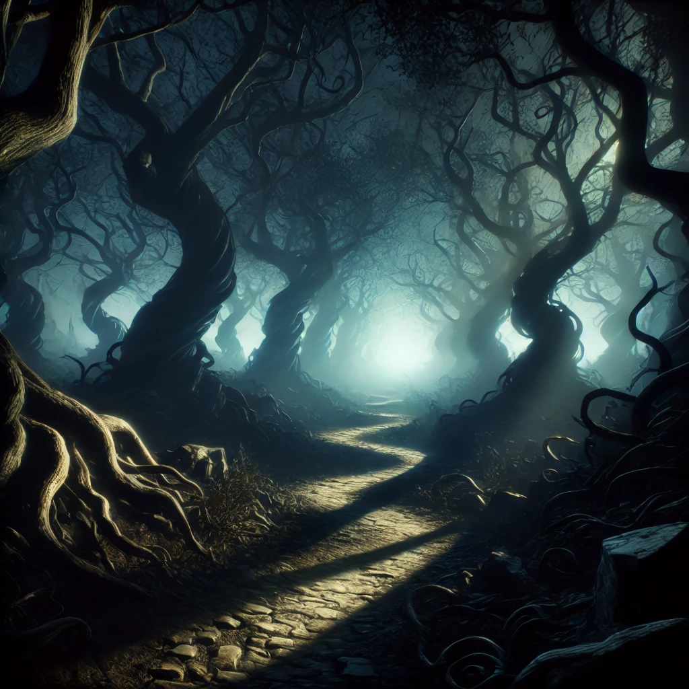
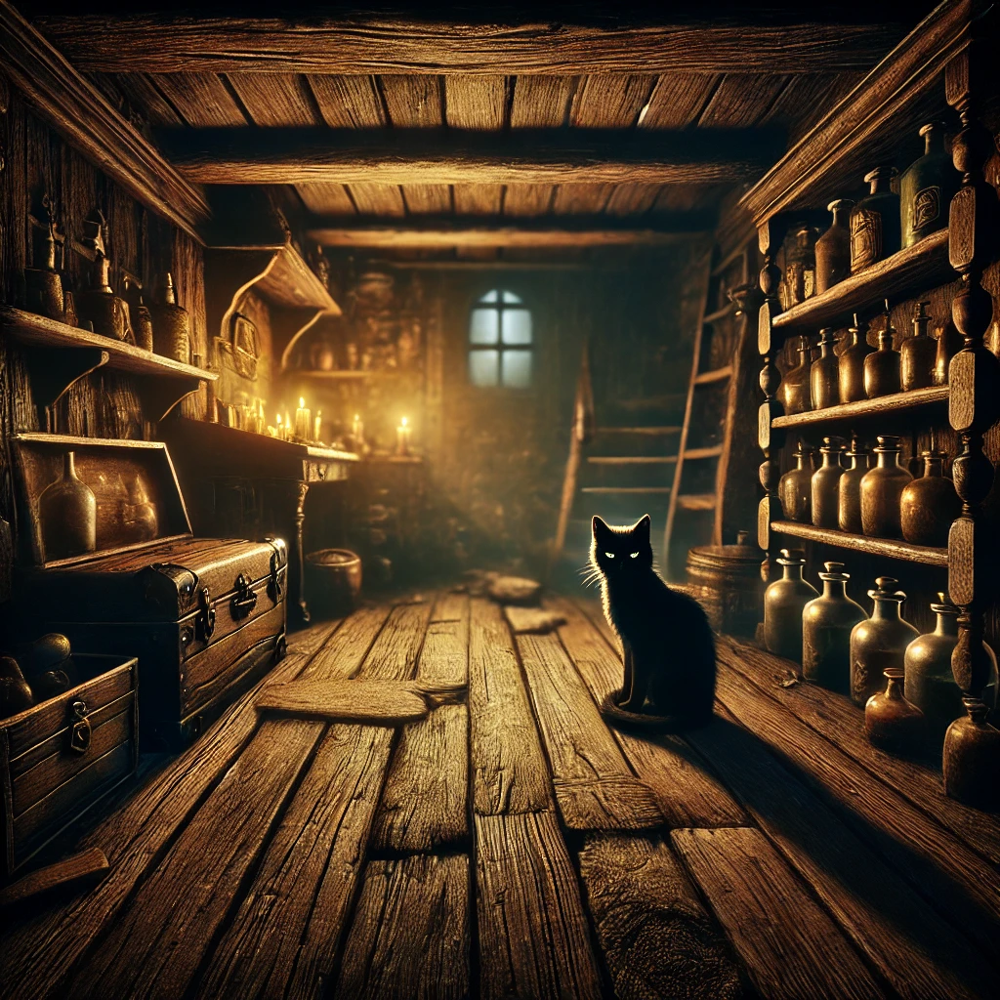
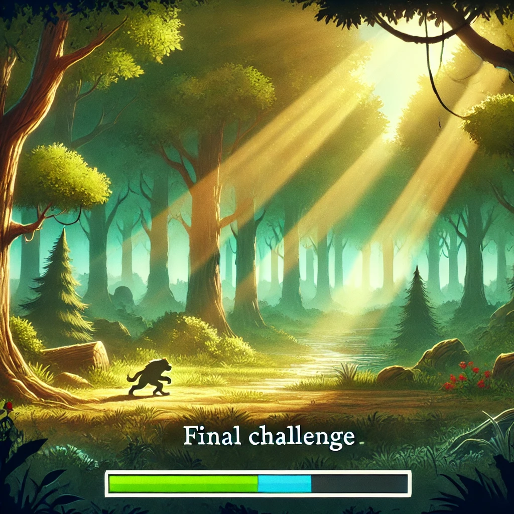

# 🌲 Shadowed Realms: A Text-Based Python Adventure 🌲

**Shadowed Realms** is a thrilling text-based adventure game where every decision matters. Traverse through mysterious lands, solve challenging riddles, and make daring choices to survive.

> My goal for this project is to develop fully this code and place it with a 5D VR gameplay. What you will see now is a small taste of how the game will look like and how the gameplay will be.
> Enjoy 🖤

---

## 🎮 Game Features
- **Dynamic Levels**: Explore 5 immersive levels, each with unique challenges and scenarios.
- **Riddle Challenges**: Test your intelligence against the Keeper of Riddles.
- **Checkpoint System**: Restart from your last stage after a defeat.
- **Multiple Endings**: Experience a different outcome with each playthrough.

---

## 📷 Level Previews

### 1. Forest of Shadows

*Navigate an eerie forest where shadows seem alive.*

---

### 2. Cave of Echoes

*Face the whispers of the past in a winding, dark cave.*

---

### 3. The Witch's House

*Explore an old house filled with strange potions and secrets.*

---

### 4. River of Reflection

*Traverse a misty river that reveals hidden truths.*

---

### 5. Escape from the Forest

*Make your final stand in a bright forest clearing.*

---

## 🚀 Getting Started

### Prerequisites
- **Python 3.x** is required to run the game.
- Install required packages using:
  ```bash
  pip install -r requirements.txt

##Code <>

    import random

  # Introduction
    print("\n\033[93mYou are being chased by bandits and see a dense, dark forest in front of you!\033[0m")
    command=input("What will you do?:"),

  # Function to show progress summary
    def show_progress(level_checkpoints, current_level, total_levels):
      print("\n\033[93m--- Progress Summary ---\033[0m")
      print(f"\033[96mCurrent Level: {current_level}/{total_levels}\033[0m")
      print(f"\033[96mCheckpoint in Level {current_level}: Stage {level_checkpoints[current_level - 1] + 1}\033[0m")
      print(f"\033[96mLevels Remaining: {total_levels - current_level}\033[0m")
      print("\033[93m-------------------------\033[0m")


  # Function to validate choices with a three-strike penalty for invalid attempts
    def get_choice(options, strike_count):
    choice = input("Choose an option: ").strip().lower()
    while choice not in options:
        strike_count += 1
        if strike_count >= 3:
            print("You hesitated too long and lost your way. GAME OVER.")
            return "death", strike_count  # Indicate player must restart the game
        print("Try again.")
        print("A chill runs down your spine as if something is watching you closely...")
        choice = input("Choose an option: ").strip().lower()
    return choice, strike_count


  # The Keeper of Shadows NPC function to provide riddles
     def keeper_riddle():
    riddles = [
        ("I speak without a mouth and hear without ears. I have no body, but I come alive with wind. What am I?",
         "echo"),
        ("I'm not a blanket, yet I cover the ground, a crystal from heaven that doesn't make a sound. What am I ?",
         "snowflake"),
        ("The more of this there is, the less you see. What is it?", "darkness"),
        ("The more you take, the more you leave behind. What am I?", "footsteps"),
        ("What comes down but never goes up?", "rain"),
        ("What goes up, but never comes down?", "age"),
        ("I am easy to lift, but hard to throw. What am I?", "feather"),
        ("How do you spell COW in thirteen letters?", "see o double you"),
        ("What is 3/7 chicken, 2/3 cat, and 2/4 goat?", "Chicago"),
        (
        "Who makes it, has no need of it. Who buys it, has no use for it. Who uses it can neither see nor feel it. What is it?",
        "a coffin"),
        ("What gets broken without being held?", "a promise"),
        ("Poor people have it.Rich people need it.If you eat it you die.What is it?", "nothing"),

    ]
    riddle, answer = random.choice(riddles)
    print(f"\033[94mThe Keeper of Shadows whispers a riddle: '{riddle}'\033[0m")
    response = input("\033[92mWhat is your answer? \033[0m").strip().lower()
    if response == answer:
        print("\033[92mThe Keeper nods approvingly, granting you safe passage or a helpful item.\033[0m")
        return True
    else:
        print("\033[91mThe Keeper chuckles softly, leaving you with an uneasy feeling.\033[0m")
        return False

# Function to set the mood before entering each level
    def level_story(level):
    stories = {
        1: "The forest ahead seems alive. The trees twist and groan as if they bear witness to secrets long forgotten.           The darkness feels oppressive, and somewhere in the distance, you hear whispers, too faint to make out the               words. The bandits are closing in, and the forest is your only chance to escape. But beware... not all who enter         this forest leave unscathed.",
        2: "You stand at the mouth of the cave, its gaping entrance exhaling cold air that chills you to the bone.               Echoes of unseen movements bounce off the jagged walls, and the faint glow of bioluminescent fungi casts eerie           shadows. They say those who enter this cave lose more than their way. Legends speak of spirits that guard                treasures and devour trespassers. Do you dare to proceed?",
        3: "The castle ruins loom ahead, shrouded in mist. The once-majestic halls are now silent, save for the                  occasional clatter of falling stones. Some say the ruins are haunted by the restless spirits of those who                perished defending its walls. Others believe treasures lie hidden within, guarded by ancient traps and curses.           The only certainty is that those who enter rarely return. Will you be the exception?",
        4: "The desert stretches endlessly before you, a sea of golden dunes under a blistering sun. But as night falls,         the sands grow cold, and the wind carries the mournful cries of those who vanished without a trace. Stories of a          hidden temple buried beneath the sands are as numerous as tales of those who sought it and disappeared. Do you           have what it takes to survive the desert’s trials?",
        5: "The final trial awaits. The mountain’s peak pierces the heavens, and the path to it is treacherous. They say          the air here is thick with the weight of forgotten battles, and the snow hides secrets best left undisturbed. At         the summit lies your destiny—or your doom. Are you ready to face the mountain’s wrath?"
    }
        print(f"\n\033[95m{stories[level]}\033[0m")


# Define each level as a function with stages and checkpoints
    def play_level(level, checkpoint=0):
    print(f"\n\033[93m--- Level {level} ---\033[0m")
    level_story(level)  # Display the story before the level begins
    strike_count = 0  # Initialize strike count
    level_data = [
        # Level 1: Forest of Shadows
        {
            "name": "Forest of Shadows",
            "description": "A dark, eerie forest filled with twisting trees and shadows that seem to move.",
            "stages": [
                {
                    "stage_name": "The Keeper's Entrance",
                    "description": "You step onto a narrow path, and suddenly a cloaked figure appears. It's The Keeper                       of Shadows.",
                    "scenarios": [
                        {
                            "scenario": "The Keeper of Shadows blocks your path, their eyes gleaming with mystery.",
                            "options": [
                                "speak", "ignore", "ask for a riddle", "negotiate", "offer trade",
                                "hide", "use item", "observe quietly", "thank him", "refuse"
                            ],
                            "outcomes": {
                                "speak": "The Keeper speaks cryptically about hidden dangers in the forest.",
                                "ignore": "The Keeper watches you leave, and you feel a strange chill.",
                                "ask for a riddle": keeper_riddle(),
                                "negotiate": "The Keeper listens, then mutters a riddle for you to solve.",
                                "offer trade": "The Keeper accepts and provides a small charm.",
                                "hide": "The Keeper fades, whispering riddles that echo through the trees.",
                                "use item": "You show the Keeper an item, and he nods approvingly.",
                                "observe quietly": "You notice symbols etched into his cloak, adding mystery.",
                                "thank him": "The Keeper inclines his head slightly, almost amused.",
                                "refuse": "The Keeper vanishes, leaving you to find your own way."
                            },
                            "death_options": ["ignore", "refuse"],  # Certain death if disrespectful
                        },
                        {
                            "scenario": "You find a patch of glowing mushrooms lighting up a dark path.",
                            "options": ["pick a mushroom", "study them", "eat one", "follow the path", "avoid them"],
                            "outcomes": {
                                "pick a mushroom": "The glow dims, but you keep the mushroom as a light source.",
                                "study them": "You notice strange runes on the mushrooms, guiding you forward.",
                                "eat one": "Your vision blurs, and you feel weak. GAME OVER.",
                                "follow the path": "The glowing mushrooms light your way safely. You see an opening                                       leading into a cave. You decide to step into the Cave of Echoes.",
                                "avoid them": "You take a darker path, feeling uneasy but unharmed."
                            },
                            "death_options": ["eat one"],
                            "next_level_trigger": "follow the path"
                        }
                    ]
                }
            ]
        },
        # Level 2: Cave Gameplay
        {
            "name": "Cave of Echoes",
            "description": "A damp, dark cave where echoes of unseen creatures fill the air.",
            "stages": [
                {
                    "stage_name": "The Entrance",
                    "description": "You step into a cave. The air is cold, and faint whispers echo around you.",
                    "scenarios": [
                        {
                            "scenario": "A fork in the cave appears: one path is narrow and dark, the other is wider but seems unstable.",
                            "options": ["take narrow path", "take wide path", "wait", "go back"],
                            "outcomes": {
                                "take narrow path": "You carefully move through the narrow path, avoiding danger.",
                                "take wide path": "The ground shakes, and rocks fall, barely missing you.",
                                "wait": "The cave grows colder, and shadows seem to gather around you.",
                                "go back": "You hesitate and lose valuable time."
                            },
                            "death_options": ["go back"]  # Hesitation leads to fatal consequences
                        }
                    ]
                }
            ]
        }
    ]

  # Process stages with checkpoints
    stages = level_data[level - 1]["stages"]

    for i in range(checkpoint, len(stages)):
        stage = stages[i]
        print(f"\n\033[95m{level_data[level - 1]['name']} - {stage['stage_name']}\033[0m")
        print(f"\033[94m{stage['description']}\033[0m")

        print(f"\033[92mCheckpoint saved at {stage['stage_name']}\033[0m")

        for scenario_data in stage["scenarios"]:
            print(f"\n\033[94mScenario: {scenario_data['scenario']}\033[0m")
            print("\033[96mWhat will you do?\033[0m")

            # Present choices and check for outcome with penalty for invalid attempts
            choice, strike_count = get_choice(scenario_data["options"], strike_count)
            if choice == "death":
                return False, i  # Player loses due to invalid choices

            if choice in scenario_data.get("death_options", []):
                print("\033[91mYou made a fatal mistake. GAME OVER.\033[0m")
                return False, i  # Death; restart from checkpoint

            outcome = scenario_data["outcomes"][choice]
            print(f"\033[92m{outcome if not callable(outcome) else outcome}\033[0m")  # NPC riddle function if called

   # Process stages with checkpoints
    stages = level_data[level - 1]["stages"]

    for i in range(checkpoint, len(stages)):
        stage = stages[i]
        print(f"\n\033[95m{level_data[level - 1]['name']} - {stage['stage_name']}\033[0m")
        print(f"\033[94m{stage['description']}\033[0m")

        print(f"\033[92mCheckpoint saved at {stage['stage_name']}\033[0m")

        for scenario_data in stage["scenarios"]:
            print(f"\n\033[94mScenario: {scenario_data['scenario']}\033[0m")
            print("\033[96mWhat will you do?\033[0m")

            # Present choices and check for outcome with penalty for invalid attempts
            choice, strike_count = get_choice(scenario_data["options"], strike_count)
            if choice == "death":
                return False, i  # Player loses due to invalid choices

            if choice in scenario_data.get("death_options", []):
                print("\033[91mYou made a fatal mistake. GAME OVER.\033[0m")
                return False, i  # Death; restart from checkpoint

            outcome = scenario_data["outcomes"][choice]
            print(f"\033[92m{outcome if not callable(outcome) else outcome}\033[0m")  # NPC riddle function if called

            # Check if the next level is triggered
            if "next_level_trigger" in scenario_data and choice == scenario_data["next_level_trigger"]:
                print("\033[92mYou have found the path to the next level!\033[0m")
                return True, i  # Move to the next level

        print(f"\033[93mCheckpoint: Returning to {stage['stage_name']} if you fail.\033[0m")

    print("\033[91mEnd of level without success; you must replay some stages.\033[0m")
    return False, i  # Lose level but return checkpoint

# Main game function
    def play_game():
    print("\033[94mYou are being chased by bandits and see a dense, dark forest in front of you.\033[0m")
    levels = 5
    level_checkpoints = [0] * levels

    for level in range(1, levels + 1):
        print(f"\n\033[93mStarting Level {level}...\033[0m")
        won_level = False

        while not won_level:
            won_level, checkpoint = play_level(level, level_checkpoints[level - 1])
            if not won_level:
                print(f"\033[91mRestarting Level {level} from checkpoint: Stage {checkpoint + 1}.\033[0m")
                level_checkpoints[level - 1] = checkpoint

        print(f"\033[92mLevel {level} complete!\033[0m")
        # Show progress after completing each level
        show_progress(level_checkpoints, level, levels)

    # Final game win condition
    if random.random() <= 0.05:
        print("\033[93mLegendary Status Achieved!\033[0m")
        print("\033[92mEnding: Your journey becomes a tale of bravery and resilience, remembered for ages.\033[0m")
    else:
        print("\033[91mEnding: Your journey remains incomplete, shrouded in mystery.\033[0m")


# Start the game
    play_game()


📖 How to Play
Choose your actions carefully during each scenario.
Solve riddles to unlock rewards and safe paths.
Survive through all five levels to escape the forest. 

🛠 Technologies Used
Python 3.x
Random module for dynamic gameplay
Modular level and stage design for extensibility

📜 License
This project is licensed under the MIT License.

GitHub:KAMENOVGEORGI
Email:g.kamenovkanchev@gmail.com
